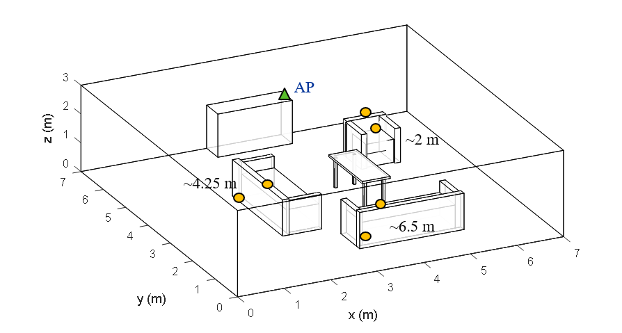
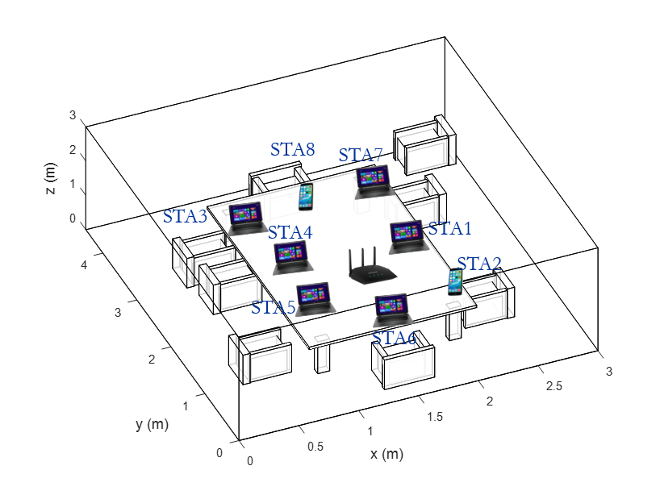
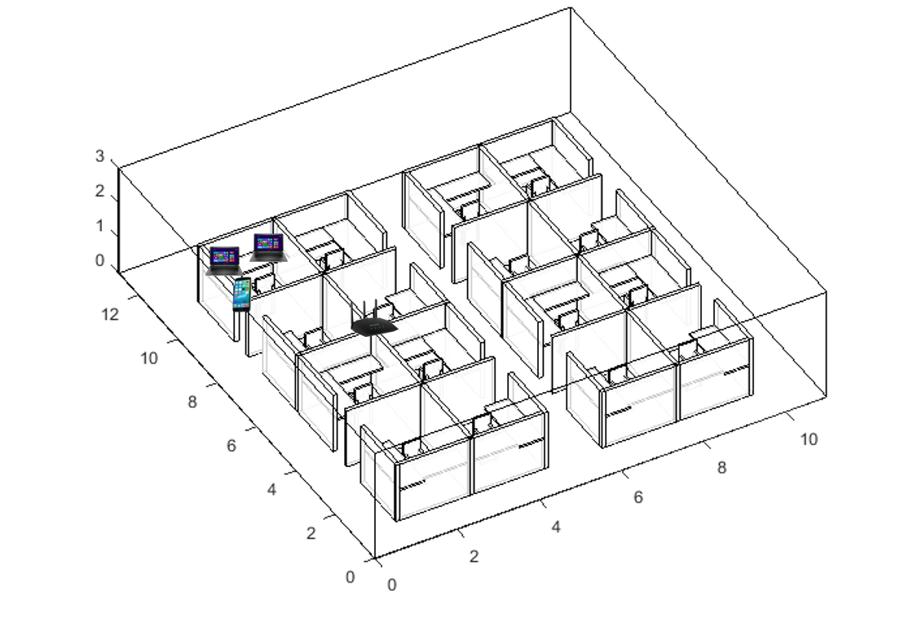
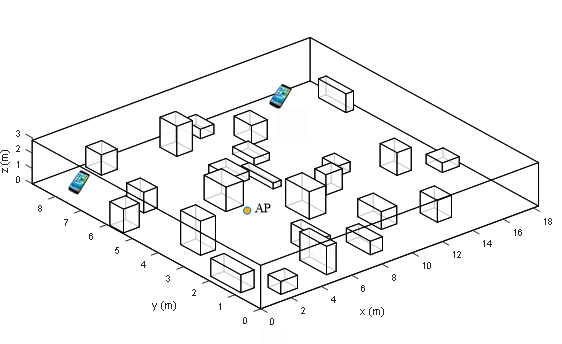

### The example scripts provided here are based on "[TGad Evaluation Methodology document](https://nam12.safelinks.protection.outlook.com/?url=https%3A%2F%2Fwww.ieee802.org%2F11%2FReports%2Ftgad_update.htm&amp;data=04%7C01%7Cyuchen.liu%40gatech.edu%7C3392376e47974f632cb808d8e9792e69%7C482198bbae7b4b258b7a6d7f32faa083%7C0%7C0%7C637516053978860685%7CUnknown%7CTWFpbGZsb3d8eyJWIjoiMC4wLjAwMDAiLCJQIjoiV2luMzIiLCJBTiI6Ik1haWwiLCJXVCI6Mn0%3D%7C1000&amp;sdata=tXSAjh36UPl2pFAc3x5igH3BBgFL13GBxQ3fpI7B7Kk%3D&amp;reserved=0)".
(Note: We implemented and modeled exactly the simulation scenarios, traffic models, and link budget parameters for point-to-point link simulation. The directional antenna model used in this repo is slightly different from the standardized antennas as defined in the document, where an analytical codebook is implemented based on Gaussian directional pattern formula to define the shape of beam patterns. Besides, we have not modeled the hardware impairments and PHY abstractions in the document.)

### 1. "TGad_Functional_test_living_room.cc"

Desciption: This script is used to evaluate the network performance in a living room scenario as defined in TGad Functional Evaluation document. The scenario consists of several furniture items, 1 DMG AP and six DMG STAs, where three of them are LoS to AP, and others are NLoS to AP. 

### 2. "TGad_performance_evaluation_living_room.cc"

Description: This script is used to evaluate the network performance of a living room scenario defined in TGad Evaluation document. The scenario consists of several furniture items, 1 set-top box (STB) and 1 TV, where uncompressed video traffic is transferred between STB and TV.

### 3. "TGad_performance_evaluation_conference_room.cc"

Description: This script is used to evaluate the performance of office conference room scenario defined in TGad Evaluation document. The scenario consists of several furniture items, 1 AP (STA 0) and 8 STAs. Traffic model used among them includes lightly compressed video, local file transfer, and web browsing.

### 4. "TGad_performance_evaluation_enterprise_cubicle.cc"

Description: This script is used to evaluate the performance of enterprise cubicle scenario defined in TGad Evaluation document. The scenario consists of several cubicle furniture items, 1 AP (STA 0) and 3 STAs (this is an example case and users can make the customized cases). Traffic model used among them includes lightly compressed video, local file transfer, web browsing, and hard disk file trasfer.

### 5. "TGad_rand_scenario.cc"

Description: This script is used to evaluate the performance of random scenario with TGad features. The scenario consists of randomly distributed obstacles and STAs. This is an example case, and users can make the customized cases by simply adjusting related parameters.

